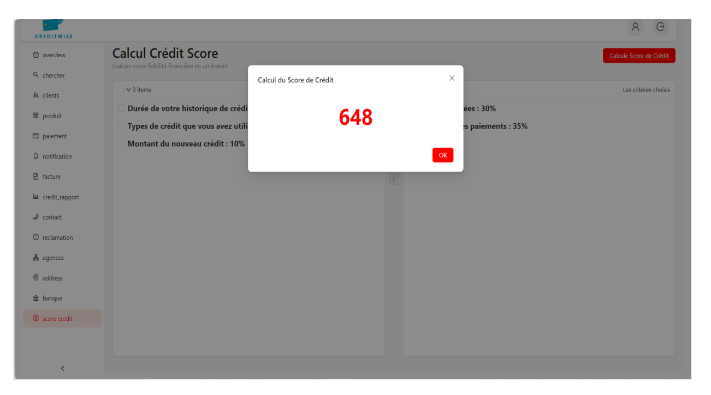
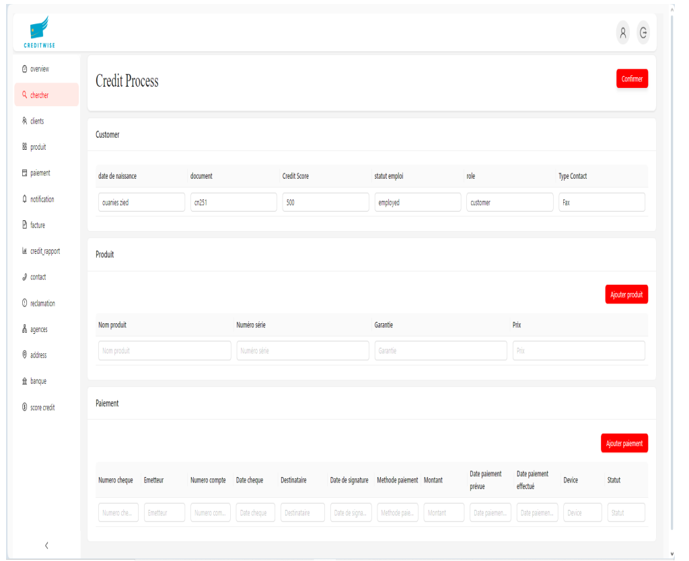
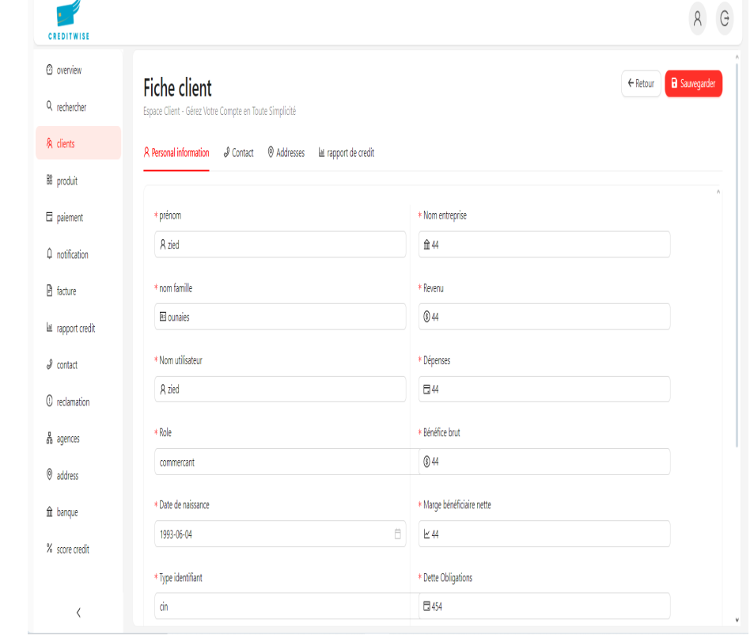
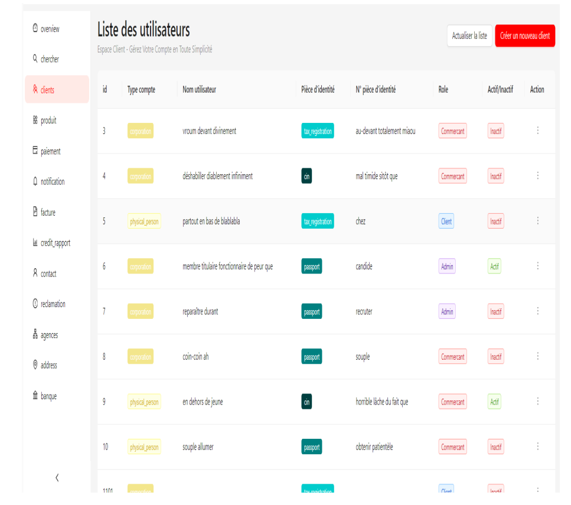
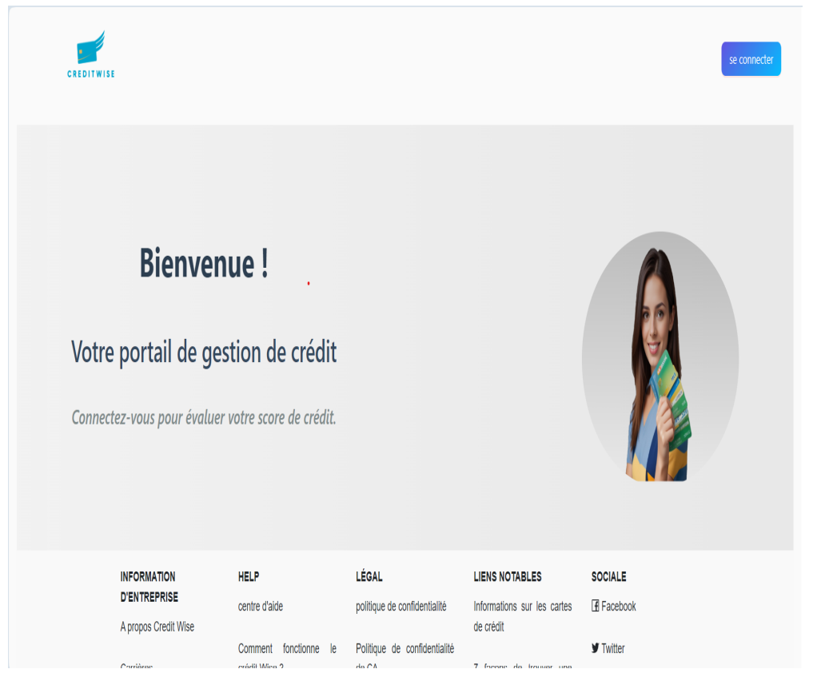
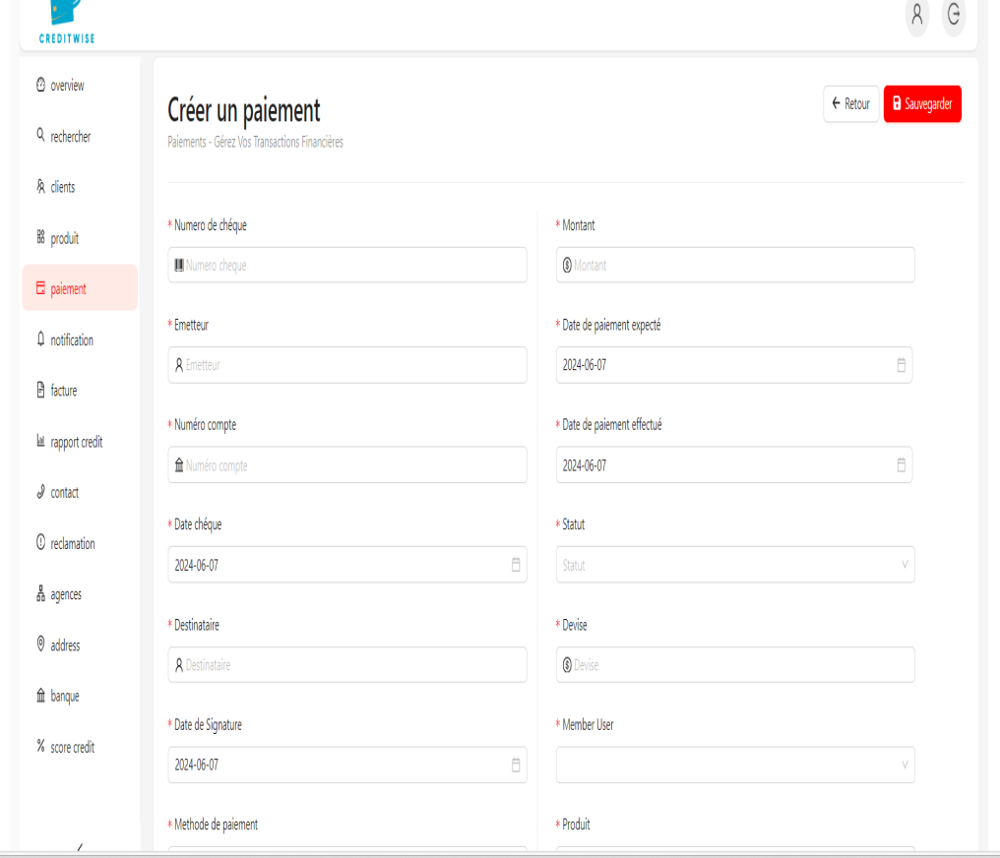
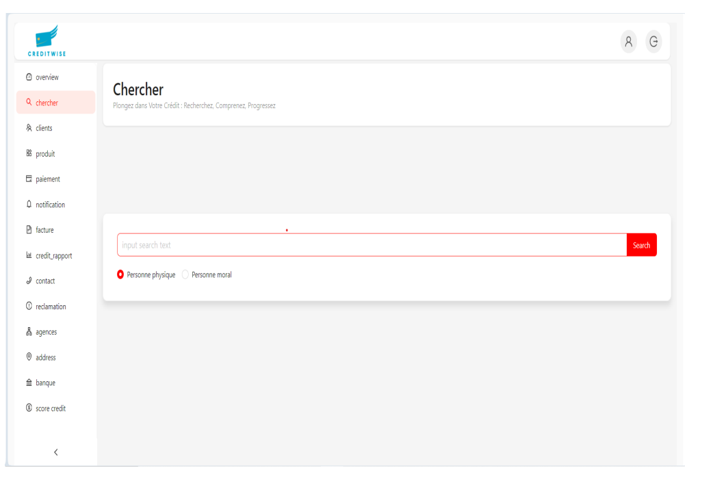

# Creditwise


# CreditScore Application 

This app lets users check their credit score and manage payment methods. Users can view their credit history and link various payment options like cards or bank accounts for easy transactions. It also provides score updates and payment reminders.

## Features
-**Credit Score**: Shows the user’s current credit score and provides insights on how to improve it.
- **User Authentication**: Secure authentication with JWT tokens.
- **Dashboard**:Displays the user's credit score, payment methods, and relevant financial data.
- **Address**: Stores and manages user addresses for billing and payment purposes.
- **Contact**: Manages user contact details for notifications and support.
- **Claim**: Allows users to file claims or disputes regarding transactions or credit reports.
- **Product**: Provides information on available financial products, such as loans or credit cards.
- **Payment**: Manages various payment methods and allows for secure transactions.
- **Invoice**: Enables users to view, download, and manage their payment invoices.
- **Agencies**: Displays credit score data from different credit reporting agencies.
- **Banks**: Integrates with banks for direct payment methods and transaction tracking.
- **CreditRapport**:Provides detailed reports on the user's credit history and score.
- **Notification**: Sends alerts for payment reminders, score updates, and important account activities.

## Technologies Used

### Front-End:
- **React.js**: For building the user interface.
- **Redux**: For state management.
- **React Router**: For handling navigation.
- **Axios**: For making HTTP requests to the API.

### Back-End:

- **springBoot**: For building the RESTful API.
- **postgresql**: For the database, using Mongoose as an ODM.
- **JWT (JSON Web Tokens)**: For user authentication and authorization.
  
## API Endpoints

### Authentication
- `POST /api/auth/register`: Register a new user.
- `POST /api/auth/login`: Login a user and get a JWT token.

### users
- `GET /api/users`: Get all users for the logged-in user.
- `POST /api/users`: Create a new users.
- `PUT /api/users/:id`: Update a users information
- `DELETE /api/users/:id`: Delete user.

### Credit Score
- `GET /api/credit-score`: Get credit score.


### creditRapport
- `GET /api/credit-score/report`: Get the credit rapport.
- `GET /api/credit-score/report:id`: Get details for a specific credit rapport.

### Notifications
- Notifications are sent via real-time updates when the credit score changes.

## Getting Started

### Prerequisites

Before you begin, ensure you have met the following requirements:

- **Java 11+**: For running the Spring Boot back-end.
- **Node.js 14+**: For running the React front-end.
- **Maven** or **Gradle**: For building the back-end (depending on your project setup).
- **MySQL** or another database: Ensure you have a database set up if required.


### Screenshot 




.png)








### Clone the Repository

```bash
git clone https://github.com/ziedounaies/creditscore_bo.git
cd creditscore_bo

